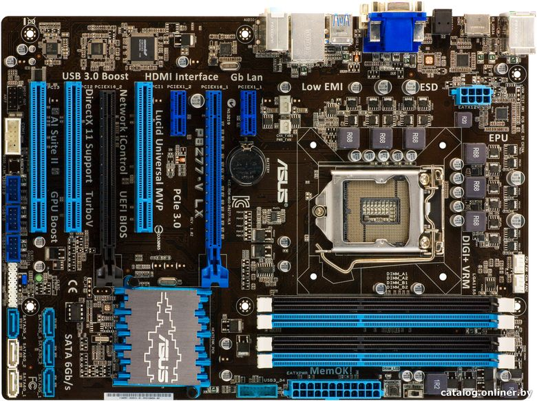
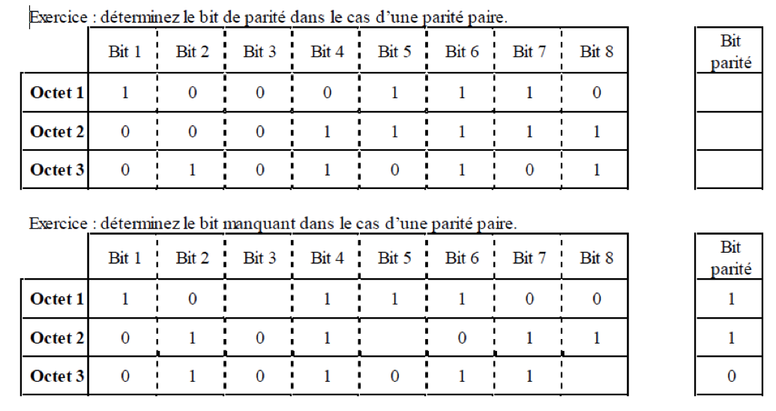

Créez un document bureautique nommé `VotreNom_SI1_ComposantsOrdi`. Dans ce document, répondez aux questions ci-dessous.

## Question 1

Voici une vidéo de présentation d'une carte mère.

<iframe width="560" height="315" src="https://www.youtube.com/embed/yf8G90v2Rz4" frameborder="0" allowfullscreen></iframe>

Après avoir regardé cette vidéo, trouvez les éléments ci-dessous pour la carte mère présentée :

* Format
* Chipset
* Socket processeur
* Nombre de ports SATA
* Nombre de ports USB 3.0 à l'arrière

## Question 2

Trouvez et insérez dans votre document une image pour chacun des types d'ordinateurs suivants :

* PC de bureau
* Ordinateur portable
* Station de travail
* Serveur

## Question 3

En quelles années sont sortis :

* Le premier PC ?
* Le premier Macintosh ?
* Le premier iPhone ?

## Question 4

On vous fournit la photo de la carte mère ci-dessous.

{:.centered}

Insérez cette image dans votre document, puis identifiez (avec des flèches ou des numéros) les éléments ci-dessous :

* Socket processeur
* Supports mémoire (RAM)
* Connecteur PCI Express
* Connecteur PCI
* Ports SATA
* Connecteur VGA

## Question 5

Cette [carte mère](http://www.ldlc.com/fiche/PB00166673.html) peut-elle accueillir ce [processeur](http://www.ldlc.com/fiche/PB00148536.html) ? Justifiez votre réponse.

Même question avec cette [carte mère](http://www.ldlc.com/fiche/PB00153454.html) et ce [processeur](http://www.ldlc.com/fiche/PB00137881.html). La réponse doit également être justifiée.

## Question 6

Réalisez un tableau dans lequel vous indiquerez les débits théoriques des standards suivants : PCI 2.0, PCI Express x16, PATA, SATA, SATA 3, eSATA, USB 1.1, USB 2.0, USB 3.0, câble réseau cat. 5, 6, 7, Wifi 802.11g, 802.11n, 802.11ac. 

Votre tableau aura la forme ci-dessous.

Standard | Débit théorique |
---------|-----------------|
PCI 2.0 | ...
PCI Express | ...
... | ...

## Question 7

Réalisez un tableau dans lequel vous rassemblerez des informations sur les processeurs suivants : Intel 8088, 80486, Pentium, Pentium 4, Core 2 Duo Penryn, Core i5 Sandy Bridge, Core i7 Haswell, Core M Broadwell, AMD Athlon, Athlon II. Votre tableau aura la forme ci-dessous.

Processeur | Année d'apparition | Nombre de coeurs | Fréquence | Mémoire cache | Finesse de gravure | Enveloppe thermique (TDP)
-----------|--------------------|------------------|-----------|---------------|--------------------|--------------------------
8088 | ...
80486 | ...
... | ...

## Question 8

Votre cousin souhaite renouveler son ordinateur de bureau et se demande quel processeur choisir. Il utilise son PC pour naviguer sur Internet, regarder des films et jouer à des jeux peu gourmands. Son budget est limité.

Rédigez un paragraphe indiquant *et justifiant* le modèle de processeur que vous lui conseillez.

## Question 9

Réalisez un tableau dans lequel vous indiquerez les quantités minimales et recommandées de RAM pour les systèmes d'exploitation suivants : Windows 95, Windows 2000, Windows XP, Windows 7, Windows 10, Mac OS X 10.0 "Cheetah", Mac OS X 10.10 "Yosemite", Linux Ubuntu Desktop 14. 

Votre tableau aura la forme ci-dessous.

Système d'exploitation | Année de sortie | RAM minimale | RAM recommandée
-----------------------|-----------------|--------------|----------------
Windows 95 | ... | ... | ...
Windows 2000 | ... | ... | ...
... | ... | ... | ...

## Question 10

Reproduisez le tableau suivant, puis complétez-le à l'aide du [cours sur la correction d'erreurs](http://prof.bpesquet.fr/cours/composants-materiels-ordinateur/#toc_67).

{:.centered}

## Question 11

Un développeur Web auto-entrepeneur souhaite acheter son nouvel ordinateur de bureau. Sa machine doit être compacte et lui permettre d'exploiter au maximum ses logiciels de développement, gourmands en temps de calcul et en RAM. Son budget est de 1000 euros écran compris. Il souhaite faire monter son PC plutôt que d'acheter un modèle de marque.

Etablissez dans un tableau la liste de tous les composants nécessaires au montage de son nouveau PC, en respectant son budhet et ses exigences. Vous indiquerez un lien d'achat pour chaque composant et calculerez le budget total de l'ordinateur.
