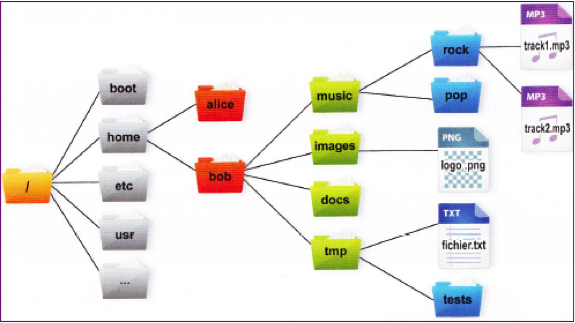
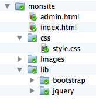

## Exercice 1

Soit l'arborescence définie ci-dessous.

{:.centered}

* Quel est le chemin absolu pour référencer le fichier `track1.mp3` ?

* Si le répertoire courant est `/home/bob`, quel est le chemin relatif vers `track1.mp3` ?

* Si le répertoire courant est `/home/bob/images`, quel est le chemin relatif vers `track1.mp3` ?

* Si le répertoire courant est `/home/bob/tmp/tests`, quel est le chemin relatif vers `track1.mp3` ?

On suppose que l'utilisateur **bob** est connecté et que le répertoire courant est `/home/bob/music`. 

* Trouvez toutes les commandes permettant de se déplacer :

    1. Dans le répertoire `rock`,
    2. Dans le répertoire `tests`,
    3. Dans le répertoire personnel de **bob**,
    4. A la racine de l'arborescence,
    5. Dans le répertoire `etc`.

## Exercice 2

Votre objectif est de créer dans votre répertoire personnel l'arborescence ci-dessous en n'utilisant que la ligne de commande. Les fichiers seront initialement vides.

{:.centered}

Pour chaque question, on suppose que le répertoire courant de départ est votre répertoire personnel.

* Faites la liste de toutes les commandes à exécuter *dans l'ordre* pour obtenir le résultat ci-dessus.

* Trouvez la commande ou les commandes à exécuter pour :
 
    1. Afficher le chemin du répertoire courant.
    2. Créer un fichier nommé `.gitignore` dans le répertoire `monsite`.
    3. Afficher le contenu du répertoire `monsite` avec des informations détaillées.
    4. Afficher le contenu du répertoire `monsite` avec des informations détaillées et en incluant les fichiers cachés.
    5. Copier le fichier `index.html` sous le nom `index2.html`.
    6. Créer un répertoire nommé `archive` dans le répertoire `monsite`.
    7. Copier *en une seule commande* tous les fichiers HTML dans le répertoire `archive`.
    8. Renommer le fichier `style.css` en `monsite.css`.
    9. Supprimer *en une seule commande* les fichiers `index.html` et `index2.html` présents dans `monsite`.
    10. Supprimer *en une seule commande* le répertoire `monsite` et tout son contenu.
