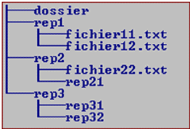

## Exercice 1

Construisez avec les commandes Windows l'arborescence ci-contre dans un répertoire `ligne-commande` créé au préalable dans votre répertoire personnel.

* Le fichier `fichier11.txt` doit contenir la ligne "MS-DOS".
* Le fichier `fichier12.txt` doit contenir la ligne "Windows".
* Le fichier `fichier22.txt` doit contenir la ligne "Linux".

{:.centered}

## Exercice 2

Trouvez comment faire pour :

* Vous déplacer dans la partition M:
* Afficher le contenu de cette partition.
* Créer un répertoire `exo2`
* Vous y déplacer.
* Créer un fichier vide `moi.txt` dans le répertoire courant.
* Afficher le message "Je suis en BTS SIO".
* Ecrire le message précédent dans le fichier `moi.txt`.
* Ajouter au fichier `moi.txt` la ligne "Et j'aime ça !".
* Vous déplacer à la racine de la partition.
* Afficher la liste des variables d'environnement.
* Afficher le nom de l'utilisateur courant.
