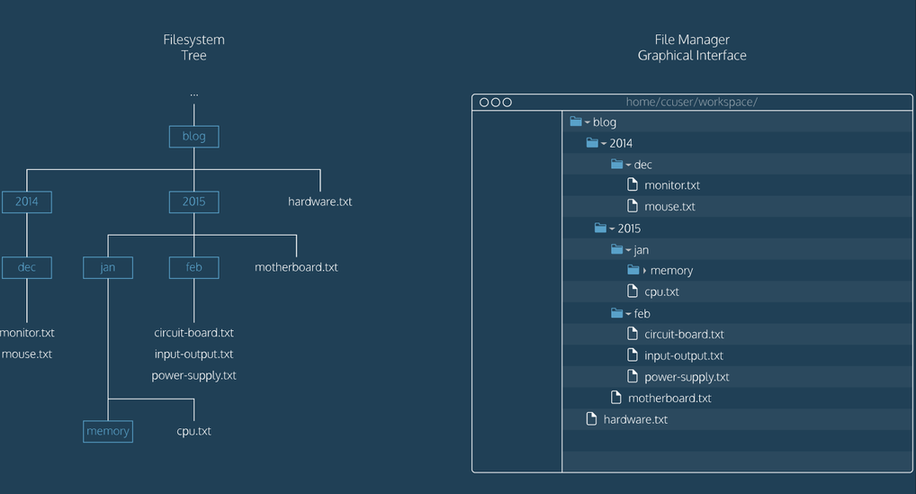

## Généralités

La **ligne de commande** est une interface textuelle pour piloter le système d'exploitation d'un ordinateur. Pour accéder à la ligne de commande, on utilise un **terminal**, appelé également **console**.

Les fichiers et répertoires d'un ordinateur forment une arborescence appelée **système de fichiers** (*filesystem*). Le point de départ du système de fichiers est un répertoire appelé **racine**, notée `/` (*slash*) sous Linux. Chaque répertoire peut contenir des fichiers ainsi que des sous-répertoires.

{:.centered}

## Naviguer dans le système de fichiers

### Commandes à connaître

* `pwd` (*print working directory*) affiche le chemin du répertoire courant.

* `ls` (*list*) affiche le contenu du répertoire courant.

* `cd` (*change directory*) permet de se déplacer dans le système de fichiers en changeant de répertoire courant. 

    * `cd monrep` fait du répertoire `monrep` le répertoire courant.
    * `cd ..` permet de remonter d'un niveau dans l'arborescence.
    * `cd /` permet de revenir à la racine de l'arborescence.

### Chemin absolu, chemin relatif

L'emplacement de chaque ressource (fichier ou répertoire) dans le système de fichiers est appelé son **chemin**. Dans un chemin Linux, le séparateur dans entre deux répertoires est le caractère `/`.

On distingue deux types de chemins :

* Un chemin **absolu** identifie une ressource en commençant à la racine de l'arborescence, avec le caractère `/`. Un chemin absolu ne dépend pas du répertoire courant et est donc valide partout.

    * `/home/baptiste/hello.txt` et `/etc/apache/httpd.conf` sont des exemples de chemins absolus.

* Un chemin **relatif** identifie une ressource à partir du répertoire courant. Il dépend donc du répertoire courant et n'est pas valide partout.

    * `../marc/adresses.txt` et `documents/cours/si1.pdf` sont des exemples de chemins relatifs.

### Répertoire personnel

Sous Linux, chaque utilisateur (sauf `root`) dispose d'un répertoire personnel à son nom situé dans `/home`. Par exemple, le répertoire personnel de l'utilisateur `nicolas` est `/home/nicolas`.

Le chemin absolu du répertoire personnel peut s'écrire de manière abrégée avec le caractère `~` (*tilde*). Par exemple, le chemin `~/music/` pour l'utilisateur `nicolas` correspond au chemin absolu `/home/nicolas/music/`.

Pour revenir dans le répertoire personnel, on peut taper la commande `cd` sans rien d'autre.

### Options des commandes

Presque toutes les commandes Linux acceptent des **options** qui modifient leur comportement. Voici par exemple les options de la commande `ls` :

* `ls -a` affiche également les fichiers cachés, qui commencent par un `.` sous Linux.
* `ls -l` affiche des informations supplémentaires, comme la date et la taille des fichiers.
* `ls -t` trie les fichiers par ordre de dernière modification.

Les options d'une commande peuvent être combinés. Exemple : `ls -alt`.

## Modifier le système de fichiers

### Commandes à connaître

* `mkdir` (*make directory*) crée un nouveau répertoire dans le répertoire courant. 

    * `mkdir monrep` crée le répertoire `monrep` dans le répertoire courant.

* `touch` crée un nouveau fichier (vide) dans le répertoire courant. 

    * `touch fic1.txt` crée un fichier vide `fic1.txt` dans le répertoire courant.

* `cp` (*copy*) copie des fichiers ou des répertoires. 

    * `cp fic1.txt monrep/` copie le fichier `fic1.txt` dans le répertoire `monrep`. 
    * `cp fic1.txt fic2.txt` duplique le fichier `fic1.txt` sous le nom `fic2.txt`.

* `mv` (*move*) déplace ou renomme des fichiers ou des répertoires. 

    * `mv fic1.txt monrep/` déplace le fichier `fic1.txt` dans le répertoire `monrep`.
    * `mv fic1.txt fic2.txt` renomme le fichier `fic1.txt` en `fic2.txt`.

* `rm` (*remove*) supprime des fichiers. `rm -r` supprime des répertoires.

    * `rm fic1.txt` supprime le fichier `fic1.txt`.
    * `rm -r monrep` supprime le répertoire `monrep` ainsi que tout son contenu.

### Caractère générique

Le caractère générique `*` (*wildcard*) permet de remplacer une partie d'un nom de fichier ou de répertoire. On l'utilise pour appliquer une commande à plusieurs éléments.

* `cp f*.txt monrep/` copie tous les répertoires dont le nom commence par un `f` et finit par `.txt` dans le répertoire `monrep`.
* `rm *` supprime tous les fichiers du répertoire courant.
