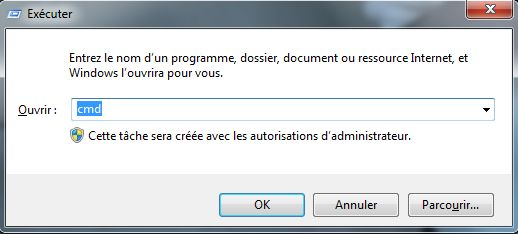
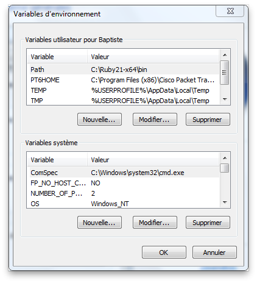

Windows dispose d'un mode ligne de commande hérité de son ancêtre MS-DOS.

Pour ouvrir un terminal sous Windows, cliquez sur le menu Démarrer et choisissez "Exécuter" (raccourci : `Touche Windows + R`). Tapez ensuite le texte `cmd`.

{:.centered}

## Naviguer dans le système de fichiers

### Lettres de lecteur

Sous Windows, les différentes partitions de la machine sont identifiées par une **lettre de lecteur**. Historiquement, le premier disque dur correspond à la lettre C.

### Chemin absolu, chemin relatif

L'emplacement de chaque ressource (fichier ou répertoire) dans le système de fichiers est appelé son **chemin**. Dans un chemin Windows, le séparateur dans entre deux répertoires est le caractère `\` (*antislash*).

On distingue deux types de chemins :

* Un chemin **absolu** identifie une ressource en commençant à la racine de la partition, par exemple `C:\`. Un chemin absolu ne dépend pas du répertoire courant et est donc valide partout.

    * `C:\Users\baptiste\hello.txt` et `F:\SI1\TP.pdf` sont des exemples de chemins absolus.

* Un chemin **relatif** identifie une ressource à partir du répertoire courant. Il dépend donc du répertoire courant et n'est pas valide partout.

    * `..\marc\adresses.txt` et `documents\cours\si1.pdf` (sans `\` au début !) sont des exemples de chemins relatifs.

### Répertoire personnel

Sous Windows, chaque utilisateur dispose d'un répertoire personnel à son nom situé dans `C:\Users`. Par exemple, le répertoire personnel de l'utilisateur `nicolas` est `C:\Users\nicolas`.

### Commandes à connaître

* `dir` (équivalent de `ls` sous Linux) affiche le contenu du répertoire courant.

* `cd` (*change directory*) permet de se déplacer dans le système de fichiers en changeant de répertoire courant. 

    * `cd monrep` fait du répertoire `monrep` le répertoire courant.
    * `cd ..` permet de remonter d'un niveau dans l'arborescence.
    * `cd \` permet de revenir à la racine de la partition.
    * `cd` permet de revenir à la racine du répertoire personnel.

* Pour changer de partition courante, on tape la lettre de lecteur de la partition suivie de `:`.

    * `d:` permet de faire de la partition D la partition courante.

## Modifier le système de fichiers

### Commandes à connaître

* `mkdir` (*make directory*) crée un nouveau répertoire.

    * `mkdir monrep` crée le répertoire `monrep` dans le répertoire courant.

* `copy` (équivalent de `cp` sous Linux) copie des fichiers ou des répertoires. 

    * `copy fic1.txt monrep\` copie le fichier `fic1.txt` dans le répertoire `monrep`. 
    * `copy fic1.txt fic2.txt` duplique le fichier `fic1.txt` sous le nom `fic2.txt`.

* `del` (équivalent de `rm` sous Linux) supprime des fichiers.

    * `del fic1.txt` supprime le fichier `fic1.txt`.

Il n'y a pas sous Windows d'équivalent simple à la commande Linux `rm -r`.

### Caractère générique

Le caractère générique `*` (*wildcard*) permet de remplacer une partie d'un nom de fichier ou de répertoire. On l'utilise pour appliquer une commande à plusieurs éléments.

* `copy f*.txt monrep\` copie dans le répertoire `monrep` tous les répertoires dont le nom commence par un `f` et finit par `.txt`.
* `del *` supprime tous les fichiers du répertoire courant.

## Affichage et édition de fichiers

### Commandes à connaître

* `echo` affiche un texte.

    * `echo Bonjour Monde` affiche le texte "Bonjour Monde".

* `type` (équivalent de `cat` sous Linux) permet (entre autres) d'afficher le contenu d'un fichier.

    * `type monfic` affiche le contenu du fichier `monfic`.

* `cls` réinitialise le contenu de la console.

### Redirections

Le caractère `>` permet de rediriger la sortie d'une commande vers un fichier **en écrasant son contenu actuel**. 

Le caractère `>>` redirige la sortie d'une commande vers un fichier **en l'ajoutant à la fin de son contenu actuel**.

* `echo Bonjour Monde > bonjour.txt` remplace le contenu du fichier `bonjour.txt` par le texte "Bonjour Monde".
* `echo Bonjour Monde >> bonjour.txt` ajoute le texte "Bonjour Monde" à la fin du fichier `bonjour.txt`.

## Environnement

### Variables d'environnement

Il est possible de définir des **variables d'environnement** pour stocker des informations globales ou modifier certains paramètres. Ces variables sont accessibles par tous les programmes. Sous Windows, on distingue les variables globales des variables locales, valables uniquement pour l'utilisateur courant.

Pour accéder à la liste des variables d'environnement, faites un clic droit sur le Poste de travail puis choisissez **Propriétés -> Paramètres système avancés -> Variables d'environnement**.

{:.centered}

Voici quelques-unes des variables d'environnement prédéfinies : 

* `USERNAME` contient le nom de l'utilisateur courant.
* `TEMP` contient le chemin du répertoire stockant les fichiers temporaires.
* `PATH` contient une liste de chemins séparés par le caractère `;` et est utilisée pour trouver les commandes exécutables du système.

### Commandes à connaître

* `set` crée ou modifie la valeur d'une variable d'environnement.

    * `set MSG=Bienvenue` crée une variable `MSG` ayant pour valeur "Bienvenue".
    * `set` sans aucun paramètre (équivalent de `env` sous Linux) affiche la liste des variables d'environnement.

* `echo` peut afficher le contenu d'une variable d'environnement.

    * `echo %MSG%` affiche le contenu de la variable `MSG`. Attention, les `%` sont indispensables !    
