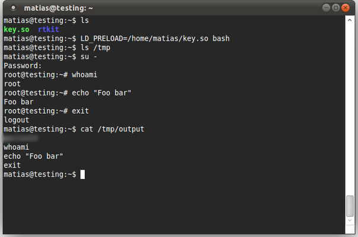

L'objectif de ce cours est de découvrir le fonctionnement et les possibilités du système d'exploitation Linux.

{:.centered}

## Préambule

### Pourquoi étudier Linux ?

Linux (également appelé GNU/Linux) est un système d'exploitation appartenant à la famille [UNIX](https://fr.wikipedia.org/wiki/Unix). Il est l'un des représentants emblématiques des [logiciels libres](https://fr.wikipedia.org/wiki/Logiciel_libre) qui garantissent à leurs utilisateurs la liberté d'étude, d'adaptation et de modification. Le code source de Linux est consultable, modifiable et redistribuable à loisir. 

Pourquoi l'étudier ? Tout simplement parce que Linux est utilisé dans de nombreux types de matériels, du supercalculateur au téléphone portable en passant bien sûr par les serveurs de l'Internet. En effet, Linux présente de nombreuses qualités :

* Il offre un coût d'installation faible (mais pas forcément nul).
* Il est réputé fiable, robuste et sécurisé.
* Il fonctionne dans de nombreux environnements différents.
* Il peut être adapté en fonction du type de matériel sur lequel il est installé.

Un nombre croissant de grandes sociétés (IBM, ORACLE...) parient sur Linux. Il est à l'origine du système d'exploitation Android installé sur de très nombreux terminaux portables.

### Histoire de Linux

La toute première version de Linux a été créée en 1991 par un étudiant finlandais nommé Linus Torvalds. Mis à disposition du public, ce système a suscité l'intérêt d'un nombre croissant de personnes qui ont voulu participer à son développement. Ce succès ne s'est pas démenti jusqu'à aujourd'hui, où des milliers de développeurs salariés ou bénévoles travaillent à l'amélioration du système.

### Les différentes versions de Linux

La philosophie défendue par Linux implique que chacun peut adapter le système à ses besoins, à condition de rendre les modifications publiques (principe de la licence GPL). Aussi, de nombreuses sociétés ont proposé leur propre version de Linux à partir des sources communes. Ces versions sont appelées des **distributions**.

Parmi les plus connues, citons [Fedora](https://getfedora.org/) (anciennement Red Hat), [Debian](https://www.debian.org/index.fr.html), [Ubuntu](https://ubuntu-fr.org/) et [Mint](http://linuxmint.com/).

Certaines distributions peuvent démarrer sans installation, directement depuis un CD-Rom ou une clé USB (exemple : Knoppix). Cela permet de tester les fonctionnalités de Linux sans être obligé de modifier le partitionnement de la machine.

## Architecture

### Le noyau de Linux

Linux est architecturé autour d'un noyau (ou **kernel**). Celui-ci reprend des bases issues du monde UNIX. Il offre un fonctionnement multitâche préemptif et peut gérer plusieurs utilisateurs simultanément.

Le noyau Linux est modulaire : il est possible de charger ou décharger dynamiquement des modules (pour gérer un périphérique spécifique, par exemple). Le code source de ce noyau (écrit en langage C) est disponible gratuitement sur le site http://kernel.org. On peut donc télécharger les sources, puis les compiler pour obtenir uner version installable du noyau. Cette manipulation est réservée aux utilisateurs curieux et avertis.

Le numéro du noyau identifie la version de Linux utilisée. Ce numéro est de la forme X.Y.Z :

* X représente le numéro majeur.
* Y représente le numéro mineur.
* Z représente la révision.

La chronologie des versions du noyau Linux est rassemblée sur [cette page](https://fr.wikipedia.org/wiki/Noyau_Linux#Chronologie).

### La gestion des utilisateurs

Contrairement à Windows, Linux a dès l'origine implémenté une gestion des utilisateurs très stricte, basée sur la notion de droits. L'administrateur du système (qui possède tous les droits) se nomme *root*.

### L'arborescence des répertoires

Linux adopte une arborescence des répertoires totalement différente de celle des systèmes Windows, qui peut dérouter l'utilisateur débutant.

Le schéma ci-dessous présente les principaux répertoires du système.

{:.centered}

On constate que la racine est identifiée par le caractère `/` (contrairement au `\` du monde Windows). 

Les principaux répertoires sont :

* `/etc` regroupe tous les fichiers de configuration.
* `/home` contient les répertoires personnels des utilisateurs (sauf root)
* `/usr` contient les fichiers statiques des programmes.

## La ligne de commande

Sous Linux, il est possible de piloter l'intégralité du système en mode console, en utilisant un terminal.

{:.centered}

Il existe de nombreuses commandes, dont certaines sont réservées à l'administrateur root. Voici quelques exemples :

* `man` : obtenir de l'aide sur une commande.
* `cd` : se déplacer dans les répertoires.
* `ls` : afficher le contenu d'un répertoire.
* `cat` : afficher le contenu d'un fichier.

## Scripts shell

Linux dispose également d'un moyen d'automatiser l'exécution de plusieurs commandes, par le biais des scripts shell Un script shell Linux est un fichier de type texte dont l'extension est .sh. En voici un exemple :

~~~
#!/bin/bash

# déclaration d'une variable chaîne
msg = "Hello World"

# affichage de la variable
echo $msg
~~~

Le langage des scripts shell Linux est très riche et offre de nombreuses possibilités.

## Les applications disponibles

Les applications disponibles sous Linux sont très nombreuses. On peut citer :

* Bureautique : Open/LibreOffice.
* Web : Firefox, Opera, Thunderbird.
* Multimédia : VLC, XMMS.
* Graphisme : GIMP.
* Outils : Acrobat Reader, Flash, Skype.
* Réseau : Apache, Wireshark.
* Développement : Eclipse, Java, .NET (projet Mono).
* SGBDR : ORACLE, MySQL, PostgreSQL.

Les principales absences dans la logithèque du monde Linux sont les logiciels Microsoft (Office, Visual Studio) et les jeux.