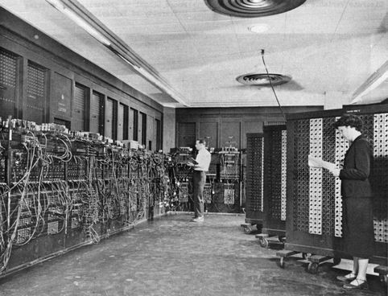
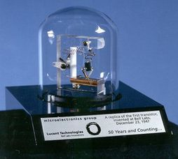
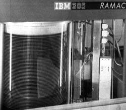
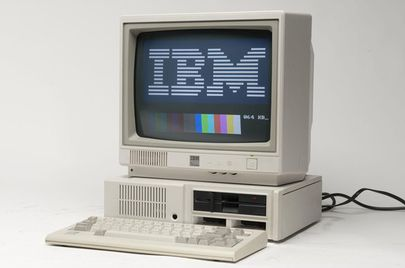
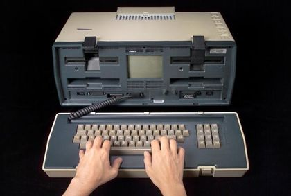
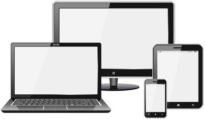
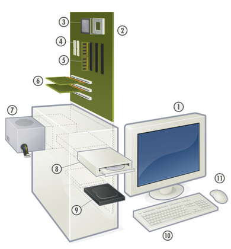

L'objectif de ce chapitre est de présenter ce qu'est un ordinateur ainsi que les bases de son fonctionnement.

## Qu'est-ce qu'un ordinateur ?

Le dictionnaire Larousse définit l'ordinateur de la manière suivante.

Ordinateur

: Machine automatique de traitement de l'information, obéissant à des programmes formés par des suites d'opérations arithmétiques et logiques.

Le terme "ordinateur" est générique. Il peut désigner aussi bien un ordinateur de bureau classique qu'un serveur de calcul ou encore un terminal mobile (tablette, *smartphone*).

Tout ordinateur, même très performant, n'est qu'une **machine** capable d'exécuter automatiquement une série d'opérations qu'on lui a demandées. Il ne dispose par lui-même d'aucune capacité d'apprentissage, de jugement, d'improvisation, bref d'aucune "intelligence". Il se contente de **faire ce qu'on lui dit de faire**. L'intérêt des ordinateurs est de savoir manipuler très rapidement et sans erreur d'énormes quantités d'informations.

Tout ordinateur est composé de plusieurs types d'éléments en interaction :

* Des éléments **matériels** : processeur, mémoire, etc.
* Un **système d'exploitation** qui permet d'exploiter les éléments matériels.
* Des **applications**, logiciels utilisant le système d'exploitation pour offrir des fonctionnalités à l'utilisateur de l'ordinateur.

## Un peu d'histoire

Même si l'histoire ancienne a vu l'apparition de diverses machines à compter et à calculer ([boulier](https://fr.wikipedia.org/wiki/Boulier), [Pascaline](https://fr.wikipedia.org/wiki/Pascaline), etc), l'informatique est une science très récente dont voici les principales étapes.

### 1945-1956 : les ordinateurs mécaniques

Les ordinateurs de cette génération sont surtout caractérisés par le fait que les instructions qu'ils comprennent correspondent spécialement à la tâche pour laquelle l'ordinateur a été conçu. Ils n'avaient aucune souplesse et des possibilités très limitées, concentrées sur une seule tâche précise. Ils utilisent également des tubes à vide (également appelées des lampes), ce qui explique leur taille, leur poids et leur consommation immense.

L'[ENIAC](https://fr.wikipedia.org/wiki/Electronic_Numerical_Integrator_Analyser_and_Computer) (*Electronic Numerical Integrator And Computer*) est un très bon exemple d'ordinateur de première génération. Il n'était qu'une gigantesque et rapide calculatrice. On définissait un "programme" en branchant tout un ensemble de câbles.

{:.centered}

### 1956-1963 : les ordinateurs à transistors

L'invention du **transistor** en 1947 bouleverse le développement des ordinateurs. Remplaçant les tubes à vide un peu partout (télévisions, radios), il a été utilisé dans un ordinateur pour la première fois en 1956, par Bell.

{:.centered}

Cette même année, IBM (*International Business Machines*, société fondée en 1940) met au point le premier disque dur, constitué d'une pile de 50 plateaux de 61 cm de diamètre. Il peut stocker 5 Mo.

{:.centered}

À partir de 1960, les ordinateurs à transistors commençaient à incorporer efficacement des périphériques que l'on considère maintenant comme courants: disques magnétiques, enregistreurs à bandes magnétiques, imprimantes, mémoire. Ils avaient également des systèmes d'exploitation rudimentaires et on pouvait stocker des programmes en mémoire.

Ces programmes stockés en mémoire et la possibilité d'aller modifier ces programmes pour leur faire réaliser d'autres fonctions ont donné à l'ordinateur la flexibilité qui leur manquait. Ils permettaient d'utiliser des mots, des phrases et des formules mathématiques plus proches du langage humain.  L'industrie du logiciel a commencé à se développer.

### 1964-1971 : les ordinateurs à circuits intégrés

Le transistor était un bon pas en avant par rapport aux tubes à vide, mais il générait beaucoup de chaleur et endommageait souvent les parties internes sensibles de l'ordinateur. L'apparition du circuit intégré en 1964 a révolutionné le monde de l'informatique. Le premier circuit intégré réunissait trois composants électroniques sur un même (petit) support. Son arrivée a permis de diminuer encore la taille des ordinateurs, ainsi que leur consommation et leur émission de chaleur.

En 1967, IBM construit le premier lecteur de disquettes, qui devient un moyen populaire de stocker des données temporairement beaucoup plus pratique que les bandes magnétiques.

Un autre développement propre à la troisième génération: l'amélioration et l'utilisation courante des systèmes d'exploitation, un programme central qui gérait la mémoire de l'ordinateur et permettait de faire
tourner plusieurs programmes sur un même ordinateur – les ancêtres de Windows !

### Depuis 1971 : la micro-informatique

Avec l'apparition des circuits intégrés, la tendance est allée vers la miniaturisation. Depuis les années 80, on est capable de mettre plusieurs centaines de milliers, voire des millions de composants sur un support de la même surface. Tout ceci permis de réduire considérablement la taille et le coût des ordinateurs, tout en améliorant leur puissance et leur fiabilité. Le microprocesseur est né.

Sa généralisation pousse des compagnies comme Tandy, Commodore et Apple à commercialiser les premiers ordinateurs personnels. En 1981, IBM lance son premier ordinateur personnel: l'IBM PC (il crée du même coup officiellement le terme). IBM donnant le droit à n'importe qui de copier son architecture : les clones de PC apparaissent partout, faisant baisser grandement les prix et rendant le PC le choix de millions d'utilisateurs.

{:.centered}

En 1984, le premier concurrent direct du PC d'IBM fait son entrée sur le marché: le MacIntosh d'Apple. Il est le premier à offrir un système d'exploitation graphique, laissant l'usager déplacer des icônes et des fenêtres avec une souris plutôt que de taper des commandes étranges avec un clavier.

{:.centered}

C'est à cette époque qu'apparaissent les premiers ordinateurs portables, ou plutôt transportables tant leur poids (plus de 10 kg) et leur prix étaient dissuasifs.

{:.centered}

### De nos jours : des ordinateurs partout

L'époque actuelle se caractérise par une course à la puissance et à la miniaturisation des composants de l'ordinateur, liée à la concurrence que se livrent les fabricants de matériel.

Cette évolution, ainsi que la généralisation de l'accès aux réseaux, a eu pour conséquence l'explosion de l'informatique mobile, avec des terminaux (smartphones, tablettes) disposant de la même puissance que les ordinateurs de bureau d'il y a quelques années...

{:.centered}

## Architecture d'un ordinateur

Même si un ordinateur peut prendre des formes très différentes, du serveur au smartphone en passant par le PC du bureau, son architecture de base est identique d'un modèle à l'autre. Seule la taille (et les performances) de ses éléments changent.

Un ordinateur se compose de plusieurs éléments matériels en interaction. L'image ci-dessous (source : Wikipedia) illustre l'architecture d'un PC de bureau .

{:.centered}

