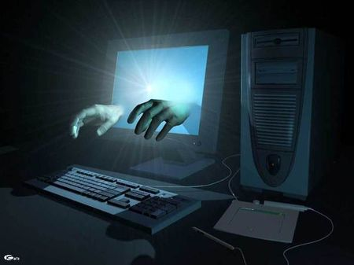
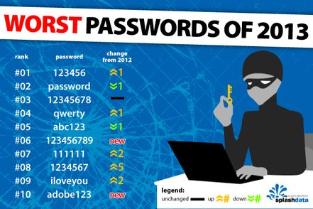

L'objectif de ce cours est de connaître les risques et les mesures essentielles à prendre pour sécuriser un poste de travail.

{:.centered}

## Introduction : les enjeux de la sécurité

A l'heure ou le moindre poste de travail est relié au réseau local de l'entreprise et connecté à l'Internet, sa sécurisation devient un enjeu essentiel pour les organisations. Un poste mal protégé peut mettre en péril non seulement les informations qui sont traitées sur le poste lui-même, mais également les systèmes auxquels il se connecte.

## Analyse des principales menaces

Les risques qui pèsent sur un poste de travail d'entreprise sont multiples. On peut classer ces risques en trois catégories :

* Les risques physiques ou naturels.
* Les risques liés à une mauvaise utilisation.
* Les risques criminels.

### Les risques physiques

Ce sont des risques qui menacent l'intégrité physique du matériel.

Exemples : Incendie, inondation, foudre, surtension électrique, surchauffe, panne matérielle.

### Les risques liés à une mauvaise utilisation

Ils sont liés à des erreurs involontaires des utilisateurs du poste :

* Perte accidentelle de données.
* Dégradation ou destruction involontaire de matériel.
* ...

### Les risques criminels

Ils sont liés à des comportements volontaires et délictueux (punis par la loi).
Exemples de risques criminels : vol ou destruction de données, vol de matériel, piratage, virus.

#### Les virus

> Un virus est un logiciel malveillant écrit dans le but de s'intégrer à un logiciel hôte puis de se dupliquer  (Wikipedia).

{:.centered}

Le mot "virus" est un terme générique issu de la médecine. En réalité, il existe de nombreux types de virus informatiques.

Exemples : les virus de boot, les macro-virus, les virus polymorphes, les rétro-virus...

#### Les autres logiciels malveillants

D'autres logiciels que les virus, sans capacité de reproduction, sont néanmoins dangereux pour le poste de travail. On les regroupe sous le terme de **logiciels malveillants** (*malware*).

On peut citer les exemples suivants :

* Les logiciels capables de se propager et de se dupliquer par leurs propres moyens au travers du réseau sans infecter de programme hôte. On les appelle des vers.
* Les logiciels conçus pour exécuter des actions à l'insu de l'utilisateur. Ils peuvent détourner, diffuser ou détruire des informations, ou encore ouvrir une porte dérobée permettant à un pirate de prendre à distance le contrôle du poste. On les appelle des chevaux de Troie ("trojan horses"). Parmi ces logiciels, certains peuvent "écouter" les saisies au clavier ("keyloggers") ou encore espionner l'utilisateur ("spyware")

#### Le piratage

On appelle "piratage" un délit dont l'objet ou l'arme est lié à l'informatique. Il est maintenant pratiqué par des bandes organisées de type mafieux plutôt que par des "petits génies" isolés. Leur objectif est avant tout financier.

{:.centered}

Un poste de travail mal protégé peut être infiltré à distance à l'aide d'un logiciel malveillant afin d'accéder à ses données et/ou de le transformer en poste "zombie" pouvant participer à des attaques massives contre d'autres réseaux.

Selon certaines sources, jusqu'à 25% des PC connectés à l'Internet seraient des zombies.

#### La malveillance interne

C'est LA principale cause des problèmes de sécurité en entreprise et sans doute la plus difficile à prévenir.  Les auteurs de malveillance peuvent agir par vengeance, par jalousie ou par intérêt.

{:.centered}

## Mesures de sécurisation

Face à toutes ces menaces, il est essentiel de protéger tous les postes de travail d'une organisation. Des règles de sécurité doivent être adoptées et respectées. On peut les classer en deux catégories :

* Les règles de protection du poste.
* Les règles de bonne utilisation du poste.

### Protection du poste de travail

#### Sécurisation physique

Un premier niveau de sécurité consiste à protéger les postes contre certains risques physiques. Par exemple, on peut placer ces postes dans une pièce soumise à contrôle d'accès (vol), en hauteur (inondation), utiliser un onduleur (surtension), installer un détecteur d'incendie...

#### Installation d'un antivirus

Un antivirus est un logiciel conçu pour identifier et éliminer des logiciels malveillants, dont les virus informatique ne sont qu'une catégorie. Pour cela, il surveille les zones essentielles de l'ordinateur (mémoire, secteurs de démarrage, courriels reçus, etc).

Un antivirus peut utiliser plusieurs techniques pour rechercher et éradiquer les virus informatiques :

* Recherche de signatures :.l'antivirus possède une base de signatures (suite d'octets caractéristiques) des virus déjà connus. Il scanne les fichiers à la recherche de ces signatures.
* Contrôle d'intégrité : l'antivirus vérifie régulièrement que les fichiers exécutables ou système n'ont pas été modifiés et prévient l'utilisateur en cas d'anomalie.
* Recherche heuristique : l'antivirus analyse le comportement global du système pour tenter de détecter les comportements « anormaux » (accès répété à certaines ressources...).

Exemples de logiciels antivirus : Avast, Norton, Kaspersky, Microsoft Security Essentials...

#### Activation d'un pare-feu

Un pare-feu (*firewall*) est un dispositif qui permet de filtrer les données échangées entre un ordinateur (ou un réseau) et l'extérieur. L'intérêt d'un pare-feu est de pouvoir contrôler le trafic entre la zone à protéger et l'extérieur.

#### Mise à jour des logiciels

Au quotidien, des dizaines de failles sont découvertes dans les systèmes (Windows, MacOS, Linux, etc.) et les logiciels (Acrobat Reader, Outlook, Word, etc.) qui équipent le poste de travail, ces failles sont très rapidement exploitées par des logiciels malveillants.

Ces failles sont corrigées au fur et à mesure par les éditeurs des logiciels, qui publient des correctifs (patches, service packs, etc). Il est donc important que tous les logiciels installés sur un poste, à commencer par le système d'exploitation et l'antivirus, soient mis à jour avec les dernières versions publiées. Cette maintenance est nettement plus simple lorsqu'elle est automatisée.

Par exemple, un poste de travail sous Windows peut être automatiquement mis à jour grâce au service Windows Update.

#### Sauvegarde des données

En cas de vol, de problème technique, ou d’attaque informatique sur le poste de travail, les données du poste seront perdues s’il n’y a pas de sauvegarde. Il convient donc d’organiser la sauvegarde des données du poste, de la façon la plus simple possible pour l’utilisateur, afin que cette sauvegarde puisse être réalisée de la façon la plus régulière possible.

Divers supports permettent de sauvegarder des données : disque dur externe, disque optique,  bande magnétique, clé USB, emplacement réseau, nuage (cloud)...

#### Chiffrement des informations

Les postes de travail sont de plus en plus légers et portables, leur exposition au vol a considérablement augmenté ces dernières années. Pour en limiter les conséquences, il est possible de chiffrer certaines informations qu'il contient (disque dur, clé USB).

Le chiffrement d'informations consiste à les rendre incompréhensibles à toute personne ne disposant pas de la clé de déchiffrement.

### Bonne utilisation du poste de travail

#### Adoption de mots de passe robustes

Le mot de passe est la clé d’accès à l’information, cette clé doit être personnelle et suffisamment complexe pour ne pas pouvoir être trop facilement découverte.

Il faut donc que chaque utilisateur choisisse un mot de passe suffisamment fort pour résister le plus longtemps possible à une attaque. A l'heure actuelle, un PC adapté est capable de tester 8,3 milliards de possibilités par seconde afin de trouver un mot de passe chiffré.

{:.centered}

Les paramètres de robustesse d'un mot de passe sont :

* La taille (nombre de caractères)
* La présence de caractères non alphanumériques (symboles)
* Le côté aléatoire (aucun lien direct avec l'utilisateur)
* L'unicité (pas de mot de passe partagé entre différents sites)
* Le changement régulier.

Des sites comme [Password Strength Checker](http://www.passwordmeter.com/) permettent de vérifier la robustesse d'un mot de passe. Certains OS permettent également d'imposer une complexité minimale aux mots de passe des utilisateurs.

#### Gestion des droits des utilisateurs

Tous les systèmes d'exploitation récents permettent de gérer les droits des différents utilisateurs d'un poste de travail. Il faut trouver un équilibre entre la protection du système et la possibilité laissée aux utilisateurs de l'exploiter pour effectuer leurs tâches.

#### Prudence vis-à-vis de l'extérieur

La plupart des infections de postes par des logiciels malveillants se font par ouverture d'un document ou d'une page Web frauduleuse. Certaines techniques de piratage (hameçonnage, ingéniérie sociale) exploitent la crédulité des utilisateurs.

Chaque utilisateur doit donc observer une politique de prudence vis-à-vis du monde extérieur :

* Eviter de se connecter à des sites suspects.
* Eviter de télécharger des logiciels dont la source n'est pas digne de toute confiance.
* Etre attentif(ve) avant de cliquer sur un lien hypertexte (examinser son URL permet souvent de détecter une tentative d'hameçonnage).
* Supprimer directement les courriels suspects.

## Conclusion

Aucun poste de travail ne sera jamais complètement à l'abri face à la variété des menaces et à la disponibilité d'outils de plus en plus performants. Cependant, les mesures précédentes permettent de limiter grandement les risques. Une sécurité élémentaire vaut mieux que pas de sécurité du tout.
