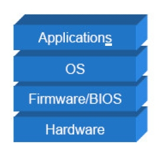
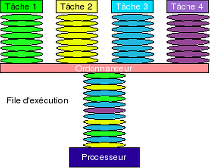
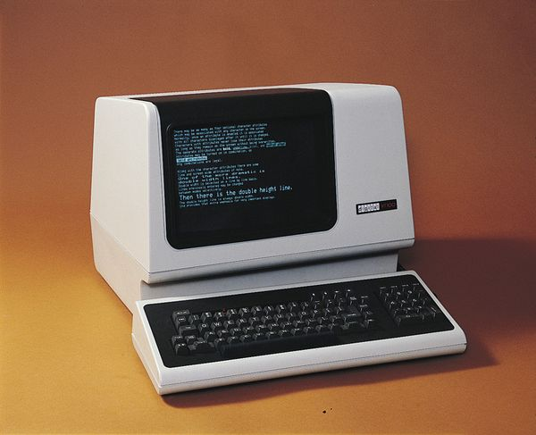
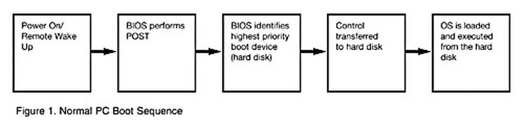
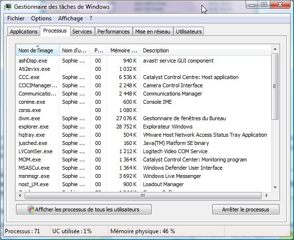

L'objectif de ce cours est de comprendre le rôle du système d'exploitation d'un ordinateur.

## Rôle du système d'exploitation

Un système d'exploitation est un logiciel qui fait le lien entre les ressources matérielles d'un ordinateur (processeur, disque dur...) et les logiciels de l'utilisateur.

Le système d'exploitation (ou OS, *Operating System*) permet aux logiciels d'application de fonctionner indépendamment du matériel : il offre ce qu'on appelle une **couche d'abstraction** : plutôt que se s'adresser directement aux différents périphériques, les logiciels passent par le système d'exploitation, qui traduit leurs appels auprès du matériel.

{:.centered}

Les logiciels d'application n'ont pas besoin de savoir comment fonctionne le matériel de l'ordinateur. Leur seul interlocuteur est le système d'exploitation qui les accueille. En revanche, le SE doit être capable de dialoguer avec les différents périphériques de l'ordinateur, d'où la nécessité de pilotes (drivers) pour interagir avec le matériel.

Un système d'exploitation a de nombreuses responsabilités :

* Permettre l'exécution et le contrôle des logiciels applicatifs.
* Gérer les périphériques matériels (processeur, mémoire vive, carte graphique...).
* Fournir une Interface Homme-Machine (IHM) à un ou plusieurs utilisateurs.

## Fonctionnalités d'un système d'exploitation

### Gestion des applications

#### Systèmes monotâche

Comme son nom l'indique, un système **monotâche** ne peut gérer qu'une seule tâche (un seul programme) à la fois. Un programme lancé par un système mono-tâche monopolise les ressources de la machine jusqu'à sa fin d'exécution.

Ses deux principaux inconvénients sont :

* Elle ne permet pas d'utiliser plusieurs programmes simultanément.
* En cas de blocage du programme, tout le système est arrêté : il faut redémarrer l'ordinateur...

Les systèmes mono-tâches ont quasiment disparu du paysage des SE.

#### Systèmes multitâche

Un système multitâche permet l'exécution simultanée de plusieurs programmes sur une machine. 

Cette simultanéité n'est qu'apparente : en réalité, chaque programme est exécuté tour à tour à un rythme très rapide, ce qui donne l'illusion d'une exécution en parallèle.

Il existe deux variantes possibles du multitâche. En multitâche **coopératif**, chaque application décide elle-même du moment où elle "rend la main" pour permettre aux autres de s'exécuter. Le système est dépendant des applications qu'il accueille. Un programme mal conçu peut monopoliser les ressources ou bloquer le système en cas de crash.

Ce type de multitâche, présent sur les SE des années 1990, a été remplacé par le multitâche **préemptif**. Ici, le système d'exploitation distribue les temps d'exécution entre les différents programmes, à la manière d'un chef d'orchestre. Les ressources sont mieux partagées entre les applications, et une erreur dans un programme ne menace plus l'ensemble du système.

### Gestion du processeur

Le processeur est l'unité centrale d'exécution d'un ordinateur. A chaque top de son horloge interne, soit plusieurs millions de fois par seconde, il exécute une instruction (ou une partie d'instruction). A un instant donné, un processeur ne peut donc effectuer qu'un traitement à la fois. 

Pour obtenir un multitâche préemptif, le SE dispose d'un ordonnanceur qui gère l'ordre dans lequel les instructions des différents programmes sont exécutées. Des priorités peuvent être affectées à chaque tâche en fonction de leur importance.

{:.centered}

### Gestion de la mémoire

Pour fonctionner, les programmes occupent et utilisent de la place en mémoire. Le système d'exploitation gère l'allocation de cette mémoire aux applications. Quand la place en mémoire vive (RAM, *Random Access Memory*) vient à manquer, une partie du disque dur est utilisée comme mémoire virtuelle (plus lente que la RAM).

Un système d'exploitation consomme aussi de la RAM pour son propre usage. Les systèmes récents ont tendance à être de plus en plus "gourmands" en RAM. A titre d'exemple, Windows 7 nécessite 4 Go de RAM pour un usage confortable.

### Gestion des partitions

Un système d'exploitation doit piloter les différents périphériques de stockage présents sur l'ordinateur pour pouvoir y lire et écrire des données de manière persistante.

Un périphérique de stockage (disque dur, SSD, clé USB...) est divisé en zones spécifiques appelées **partitions**. Une partition est une unité de stockage logique, qui peut être **formatée** pour stocker des informations telles que des fichiers de données ou des applications. Pendant la phase d'installation, la plupart des systèmes d'exploitation partitionnent et formatent automatiquement l'espace disque.

### Stockage des fichiers

La gestion des données persistantes sur les périphériques de stockage est assurée par le système de gestion de fichiers (SGF) du système d'exploitation. Les fichiers sont découpés sous forme de blocs et répartis sur le support de stockage.

Un SGF offre les fonctionnalités suivantes :

* Manipulation des fichiers et des répertoires.
* Localisation des fichiers.
* Sécurité et contrôle des fichiers.

Il existe de nombreux SGF offrant des niveaux de fonctionnalités variables, comme FAT32 (File Allocation Table), NTFS (New Technology File System) ou ext4 (EXTended File System version 4). Le SGF est choisi lors du formatage d'une partition.

Le système d'exploitation propose également des mécanismes de gestion des fichiers et des répertoires : création, copie, suppression, formatage...

### Interface Homme-Machine

L'IHM d'un système d'exploitation permet à l'utilisateur d'interagir avec le système : lancement de commandes, utilisation de logiciels, accès aux fichiers...

Jusqu'au milieu des années 1980, les systèmes disposaient uniquement d'une IHM textuelle.

{:.centered}

De nos jours, la plupart des systèmes offrent une IHM graphique conviviale, ou GUI (*Graphical User Interface*). Il reste possible de les utiliser en mode texte grâce à un terminal. Elle présente à l'utilisateur un bureau virtuel et permet le pilotage du système à la souris.

[Cet article](http://www.clubic.com/video/reportages/video-de-windows-1-a-windows-10-30-ans-d-evolutions-en-10-minutes-video-468260.html) illustre bien l'évolution de l'IHM des OS de la famille Windows.

{:.centered}

### Gestion des utilisateurs

On peut classer les systèmes d'exploitation en deux catégories, selon leurs possibilités de gestion des utilisateurs.

#### Systèmes mono-utilisateur

Un système mono-utilisateur ne peut gérer qu'un seul utilisateur à la fois. Les systèmes d'exploitation des ordinateurs personnels (Windows, Mac OS), ont longtemps été mono-utilisateur.

#### Systèmes multi-utilisateurs

Un tel système permet à plusieurs utilisateurs d'exploiter simultanément les ressources de la machine, ce qui introduit de nouvelles problématiques : 

* L'environnement propre à chaque utilisateur (identification, ressources propres).
* La sécurité de l'accès partagé aux données et aux programmes.
* Les droits de chaque utilisateur (accès aux fichiers, exécution de programmes).

Pour des raisons de sécurité, tous les utilisateurs n'ont pas les mêmes droits sur le système. Seul un utilisateur particulier (`Administrateur` sous Windows, `root` sous Linux) possède tous les droits. La majorité des systèmes d'exploitation récents sont multi-utilisateurs.

## Architecture d'un système d'exploitation

Un système d'exploitation est typiquement composé :

* D'un noyau.
* De bibliothèques.
* D'un ensemble d'outils système.
* De plusieurs applications de base.

### Le noyau

Le noyau (ou *kernel*) est la partie fondamentale du système d'exploitation. Il est chargé en mémoire vive durant le démarrage de l'ordinateur (*boot sequence*). 

{:.centered}

Après le démarrage, la mémoire est divisée en deux parties :

* L'espace noyau, réservé au noyau lui-même.
* L'espace utilisateur, dédié aux applications.

Cette division permet d'augmenter la robustesse du système : aucun programme de l'espace utilisateur ne peut accéder à la mémoire du noyau.

Le noyau remplit les fonctions essentielles du système d'exploitation :

* Gestion du matériel.
* Exécution des programmes (sous la forme de processus).
* Echanges entre matériel et logiciels.

### Notion de processus

Un **processus** est l'entité qui représente l'exécution d'un programme sur un ordinateur. Son état évolue au cours du temps : il a un début, un déroulement et une fin.

Le noyau du système d'exploitation offre des fonctions de contrôle des processus en cours d'exécution (exemple : gestionnaire des tâches sous Windows).

{:.centered}

Un logiciel lancé par l'utilisateur est manipulé par le noyau sous la forme d'un ou plusieurs processus. Chaque processus se voit attribuer des droits (souvent ceux de l'utilisateur).

#### Processus système

Il existe des processus lancés par le système d'exploitation lui-même pour assurer des fonctions de base : ce sont les processus système, qui s'exécutent en arrière-plan. On les appelle **services** sous Windows et **démons** (*daemons*) sous UNIX et Linux.

#### Processus légers

Certains programmes s'exécutent sous la forme d'un ensemble de processus légers (ou *threads*) appartenant à un même processus père. Cela permet de faciliter la communication entre les différents threads d'un processus et d'améliorer les performances de certaines opérations (traitements en parallèle).

### Les bibliothèques

Une bibliothèque (ou librairie) regroupe un ensemble de fonctions souvent utilisées par les programmes. Elle peut contenir des fonctions simples (exemples : sinus, cosinus) ou très complexes (exemples : rendu graphique 3D). Elles sont partagées par les logiciels qui s'exécutent et leur offrent des API (*Application Programming Interface*).

Une bibliothèque évite à chaque programme de devoir réécrire manuellement les fonctions qu'elle propose.

La plupart des systèmes d'exploitation récents supportent les bibliothèques dynamiques, qui sont chargées par les programmes sans en faire directement partie. Cela permet de diminuer la taille des fichiers exécutables et la place occupée en mémoire. Elles sont identifiées par l'extension `.dll` sous Windows et `.so` sous Linux.

### 32 bits, 64 bits

Un système d'exploitation peut être disponible en versions 32 bits et 64 bits afin de s'adapter au processeur de l'ordinateur. Ce nombre de bits correspond à la taille des registres mémoire du processeur. L'augmentation de la largeur des registres permet, entre autres, d'adresser une quantité plus important de mémoire vive. La quantité de RAM utilisable est limitée à 4 Go avec un processeur 32 bits. Un processeur 64 bits peut faire tourner un OS 32 bits, mais l'inverse n'est pas vrai. 

Les systèmes d'exploitation de la famille Windows existent en version 64 bits depuis Windows XP.

## Le marché des systèmes d'exploitation

Il existe plusieurs familles de systèmes d'exploitation, adaptées à différents types de machines.

### Les serveurs

Un serveur est une machine dont le rôle est d'héberger des données ou des programmes afin de répondre aux demandes de ses clients.

Exemples de systèmes d'exploitation pour serveurs : Windows 2008 Server, Solaris, FreeBSD, Linux Debian.

### Les postes de travail

Un poste de travail est destiné à un seul utilisateur, pour un usage professionnel ou personnel. La grande majorité des postes de travail utilise un système d'exploitation de la famille Windows.

Exemples de systèmes d'exploitation pour postes de travail : Windows 7, Windows 10, Mac OS X, Linux Ubuntu.

### Les terminaux mobiles

Ces dernières années ont vu apparaître un grand nombre d'appareils mobiles de plus en plus sophistiqués : téléphones portables, tablettes... Ces périphériques embarquent des systèmes d'exploitation spécifiques ou des versions modifiées de systèmes existants.

Exemples de systèmes d'exploitation pour appareils mobiles : iOS, Android, Windows Phone.
